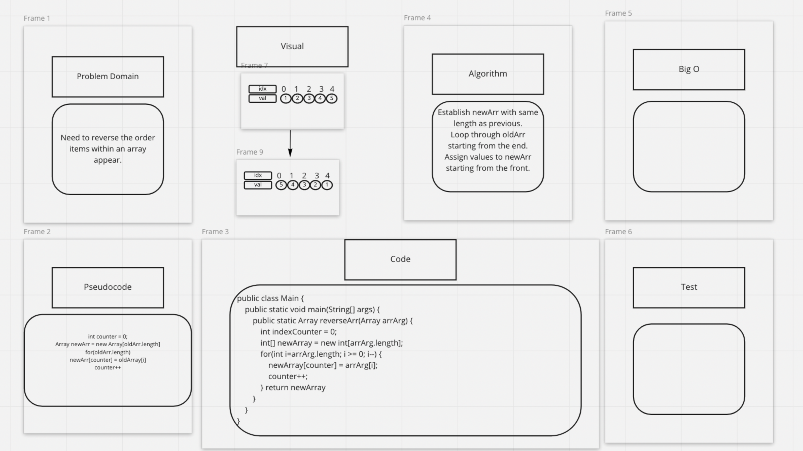

#Array Reverse
Takes an array as an argument. Without utilizing any of the built-in methods available to your language, return an array with elements in reversed order.

## Example
###Input
```javascript
[1, 2, 3, 4, 5, 6]

[89, 2354, 3546, 23, 10, -923, 823, -12]

[2, 3, 5, 7, 11, 13, 17, 19, 23, 29, 31, 37, 41, 43, 47, 53, 59, 61, 67, 71]
```
### Output
```Javascript
[6, 5, 4, 3, 2, 1]

[-12, 823, -923, 10, 23, 3546, 2354, 89]

[71, 67, 61, 59, 53, 47, 43, 41, 37, 31, 29, 23, 19, 17, 13, 11, 7, 5, 3, 2]
```

<br><br><br>
[Back to Original README](../../README.md)
<br><br><br>

## WhiteBoard


