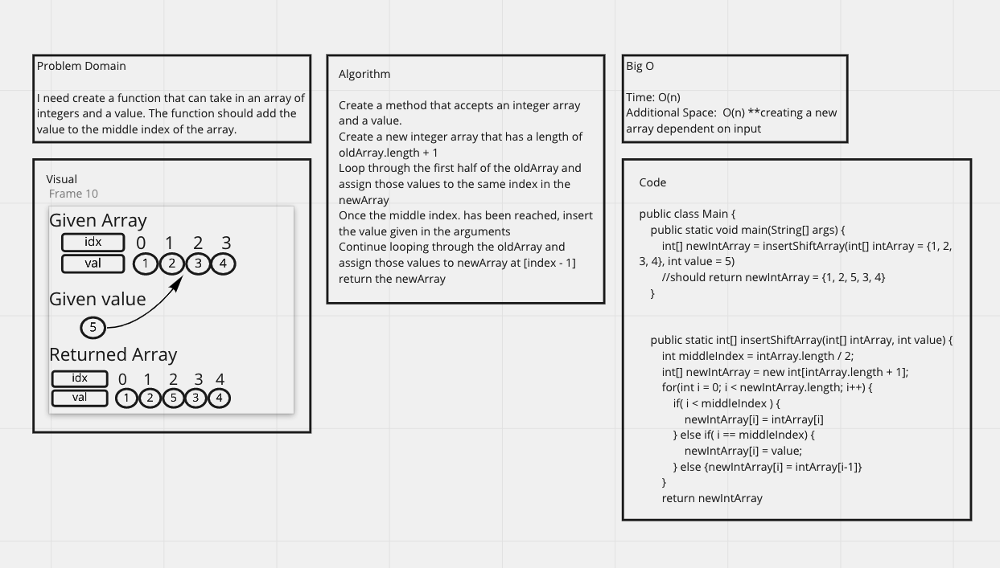

#Array Binary-Search
Takes in 2 parameters: a sorted array and the search key. Without utilizing any of the built-in methods available to your language, return the index of the array’s element that is equal to the value of the search key, or -1 if the element is not in the array.

Need to do this still.
## Example
###Input
```javascript
[4, 8, 15, 16, 23, 42], 15

[-131, -82, 0, 27, 42, 68, 179], 42

[11, 22, 33, 44, 55, 66, 77], 90

[1, 2, 3, 5, 6, 7], 4
```
### Output
```Javascript
2
4
-1
-1
```

<br><br><br>
[Back to Original README](../../README.md)
<br><br><br>

## WhiteBoard
