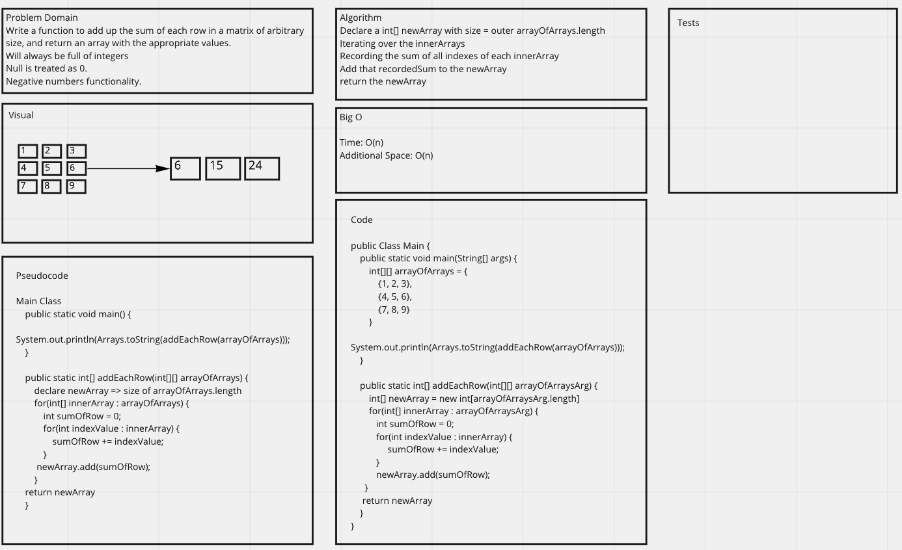

# WhiteBoard Interview
- This was my whiteboard interview with [Brandon Rimes](https://github.com/BrandonRimes) as my interviewer.
- I was asked to write a function within 30 minutes to add up the sum of each row in a matrix of arbitrary size, and return an array with the appropriate values. I had to avoid utilizing any of the built-in methods available to the Java language.
- Parameters
  - The matrix will always be full of integers.
  - Negative values are possible.
  - All nulls will be counted as zeros.
## Example
### Input
```javascript
[ [1, 2, 3], [3, 5, 7], [1, 7, 10] ]	
[ [0, 1, 5], [-4, 7, 2], [-3, 12, 11] ]	
```
### Output
```Javascript
[6, 15, 18]
[6, 5, 20]
```

<br><br><br>
[Back to Original README](../../README.md)


## WhiteBoard
