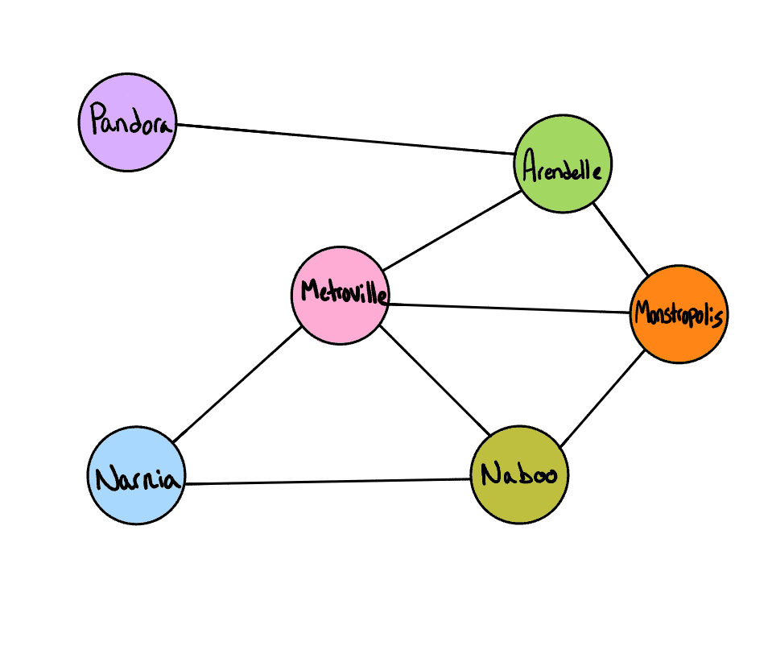

# Library
## Graph - Breadth-First
Write the following method for the Graph class:

breadth first
Arguments: Node
Return: A collection of nodes in the order they were visited.
Display the collection

-Should use a Queue and a Hashmap to accomplish

### Example

#### Output
`Pandora, Arendelle, Metroville, Monstroplolis, Narnia, Naboo`

[Class with method](../lib/src/main/java/codechallenges/graph/Graph.java)

  [Back to Original README](../../README.md)