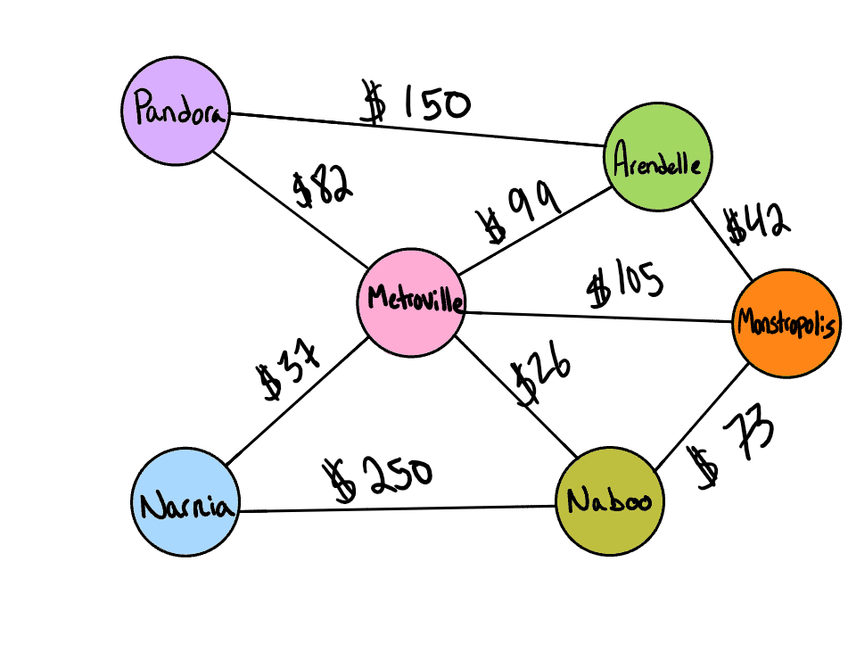

# Library
## Graph - Business-Trip
- Write a function called business trip
- Arguments: graph, array of city names
- Return: cost or null


### Example


#### Input
```aidl
[Metroville, Pandora, ]	
[Arendelle, New Monstropolis, Naboo]	
[Naboo, Pandora]	
[Narnia, Arendelle, Naboo]	
```

#### Output
- `True, $82`
- `True, $115`
- `False, $0`
- `False, $0`

[Class with method](../lib/src/main/java/codechallenges/graph/Graph.java)


[Back to Original README](../../README.md)