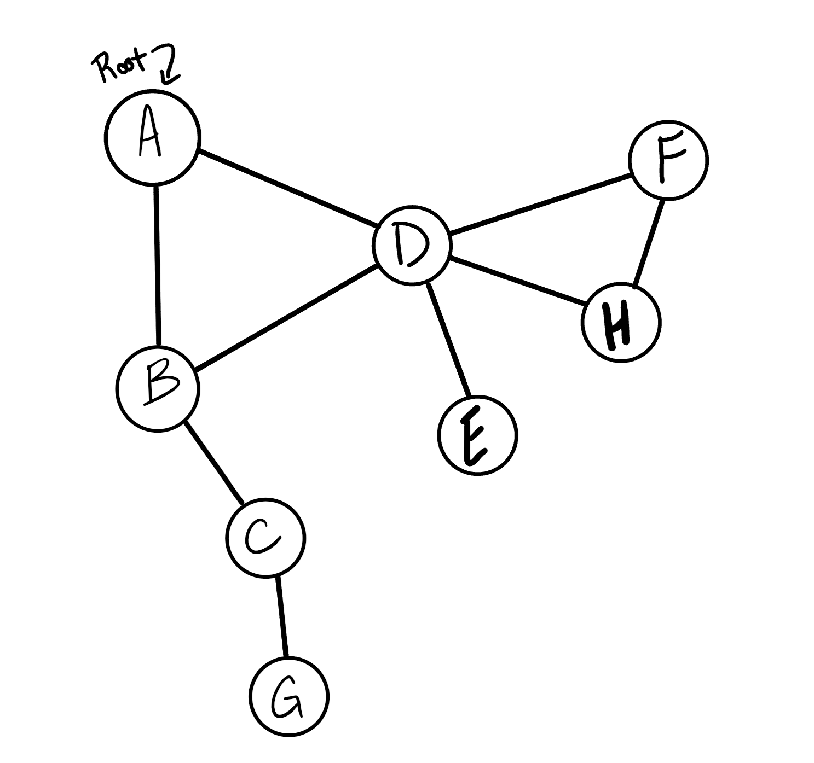

# Library
## Graph - Depth-First
- Name: Depth first
- Arguments: Node (Starting point of search)
- Return: A collection of nodes in their pre-order depth-first traversal order
- Program output: Display the collection

### Example

#### Output
`A, B, C, G, D, E, H, F`

[Class with method](../lib/src/main/java/codechallenges/graph/Graph.java)

[Back to Original README](../../README.md)